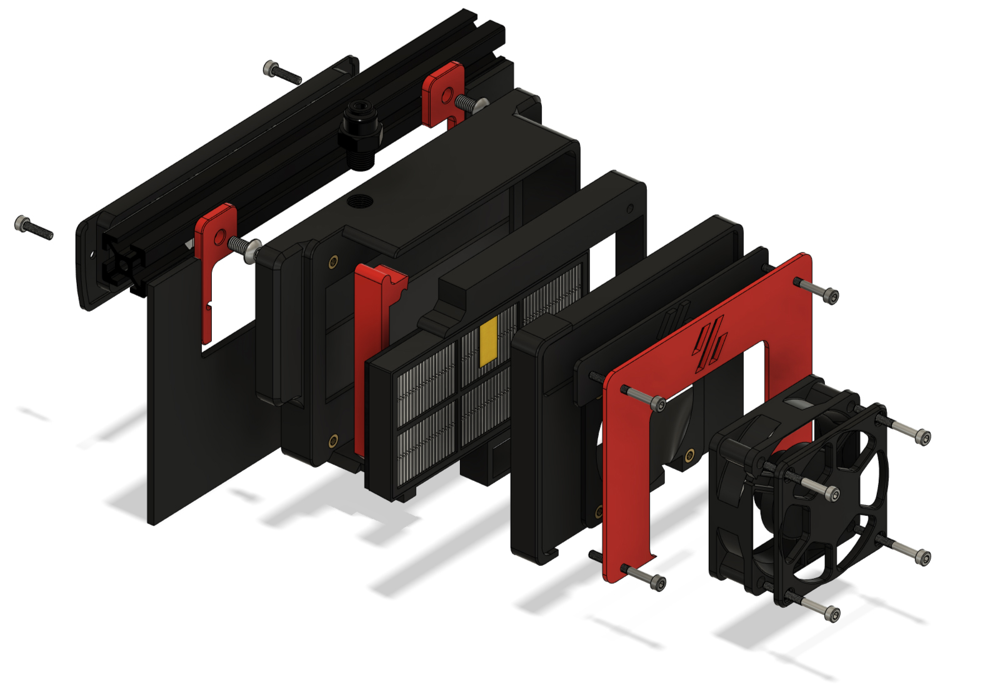
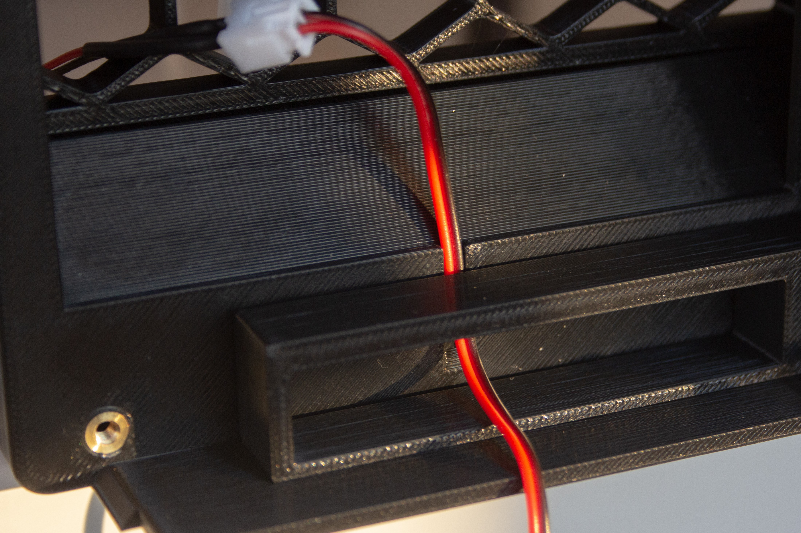

# Voron HEPA Exhaust Filter
An upgraded exhaust filter for Voron printers that features toolless, quick swappable HEPA particulate filters 

## Demo

https://user-images.githubusercontent.com/7289536/190971695-ee978da5-1548-4ee2-b269-1e507fdcde98.mp4

## Background

Improves the stock exhaust filter by ditching the crappy solder fume filter and replaces it with proper HEPA particulate filters in a redesigned housing.  These filters get a tight seal against the enclosure and can easily be swapped out using the toolless release mechanism without the need to fumble around the back of the printer with hex keys.  The filters also load in from the side instead of the back so you don't have to move your printer away from the wall to change them.  I wanted it to be easy as possible to change filters because I knew if it wasn't I wouldn't actually rotate them on a regular schedule.

This mod is designed to work alongside the [Nevemore](https://github.com/nevermore3d/Nevermore_Micro) activated carbon air scrubber, and adds particulate filtration (nevermore carbon only removes VOCs) as well as a slight negative pressure inside the chamber to help prevent diffusion.

## BOM

I made an effort to have the BOM be as streamlined as possible, and as such almost all of the hardware from the original exhaust filter can be re-used.  If you're upgrading from an existing V2 or Trident BOM, you'll only need to purchase:

- 4x M3x30 SHCS
- 2x M3 heat set inserts
- 1x+ 11cm x 5.5cm Roomba HEPA Filter
    - More info on filter sourcing [here](#hepa-filter-selection)
- 6cm of 5mmx1mm foam tape

If you are not coming from an existing build you will need the full BOM, which is **everything above** *plus*:

- 4x M3x30 SHCS (8 total)
- 2x M3x12 SHCS
- 8x M3 heat set inserts (10 total)
- 2x M5x10 BHCS
- 2x M5 t-nut
- 1/8" BSPP Bowden coupler
- 1x 60x60x20 Axial Fan

#### HEPA Filter Selection

This mod was designed around using 11cm x 5.5cm replacement Roomba HEPA filters.  This was done for a number of reasons including:

- They are reasonably high quality
- They are readily available for cheap with fast shipping from a variety of sellers on sites like Amazon (no more 2 month lead time for Aliexpress filters)
- They come built into a rigid plastic housing which allows us to clamp against them for a tight seal
- They have a protuding tab on the bottom edge for the toolless release mechanism to hook onto

These are the exact ones I purchased: https://smile.amazon.com/gp/product/B00K7DMEJ0, though similar items are available from a variety of vendors and should all be fine.

## Assembly

Assembly is pretty straightforward, everything is built up in a big stack.  I'll outline the main points here but the CAD model is your friend if you get stuck.

---
1. Add a strip of tape along the length of the inside face of the door piece.  This helps get an airtight seal against the filter frame and provides a bit of tension for the latching mechanism.

2. Start the main assembly by securing the filter mounts to the frame with the M5x10 BHCS and t-nuts

3. Drive 2x M3x12 SHCS through the exhaust grill into the backplate to attach both pieces (same method as on the stock exhaust).  Now is also a good time to route your bowden tube and fish your fan connector through.

4. Pass the fan cable through the filter surround piece and route it as shown.  The empty space is for stuffing any excess cable in.

5. Use 4x M3x30 SHCS to secure the rest of the printed parts to the backplate, being sure to add the door piece to the bottom left screw.  Tighten down the two fasteners on the right side, and snug up the left ones to the point where everything is sealed and secure, but does not interfere with the door opening and closing.  It should open and close with relative ease and a satisfying snap.
    - Also, I'd recommend adding a bit of tape to secure the fan cable so it's not flopping around in the path of the filter sliding in and out.  You can use whatever but I found that the same foam tape actually holds very well.  

6. Use the remaining 4x M3x30 SHCS to secure the fan and decorative fan grill (you want the sticker side of the fan facing outwards such that the fan is drawing air out of the chamber and across the filter).

## See Also

[Nevermore](https://github.com/nevermore3d/Nevermore_Micro) - activated carbon air scrubber that this mod is designed to be paired with  
[VEFACH](https://github.com/VoronDesign/VoronUsers/tree/master/printer_mods/KevinAkaSam/VEFACH) - An alternative to this+nevermore, that features particulate filtration and activated carbon all in one unit

---

jmatt#7569
